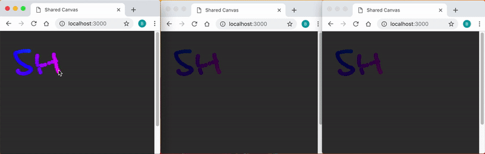

### Shared Canvas 👩‍🎨🎨👨‍🎨.

Creating of a local server. Hosting a shared, collaborative drawing canvas. 
Brodcasting messegas between clients and the server using node, express, p5.js and socket.io.

